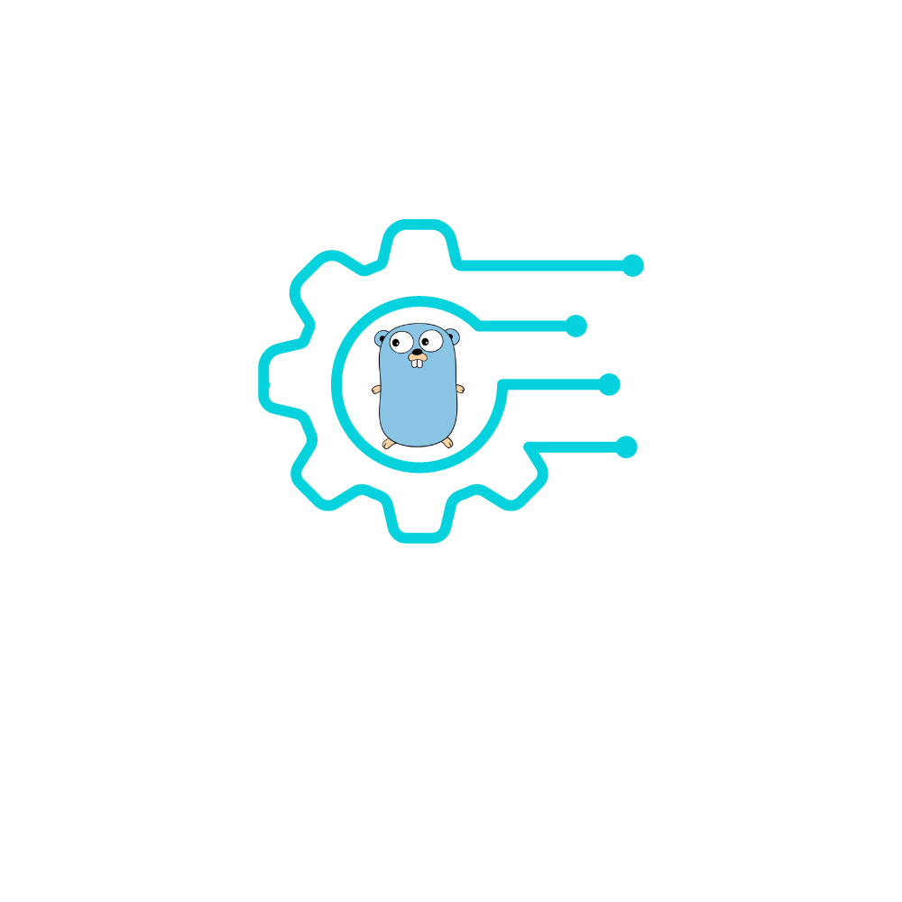

    

# goRTCServer

goRTCServer, or Real Time Communication Server in golang, is designed to run on remote linux server to answer the goPetCamera WebRTC broadcast through firebase exchanges and save off video, audio, and/or frames for Computer Vision. Docker added for VM in your favorite cloud service.
